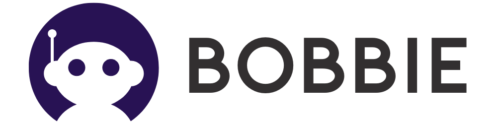

# 
# Bobbie Chatbot AI Website 🤖💬✨

Bobbie is an advanced AI-powered chatbot web application designed to provide intelligent, interactive conversations and assistance. Built with Next.js and TypeScript, it features a modern UI and seamless user experience. Welcome to your friendly AI buddy! 😊

## Features 🚀

- **Conversational AI:** Engage in natural language conversations with the chatbot. 🗣️
- **Modern UI Components:** Utilizes reusable components for a clean and responsive interface. 🎨
- **Theme Support:** Easily switch between light and dark modes. 🌗
- **User Authentication:** Secure login and personalized sessions (if implemented). 🔒
- **API Integration:** Connects to backend services for AI responses and data handling. 🔌
- **Mobile Friendly:** Optimized for both desktop and mobile devices. 📱

## Technologies Used 🛠️

- [Next.js](https://nextjs.org/) ⚡
- [TypeScript](https://www.typescriptlang.org/) 📝
- [React](https://react.dev/) ⚛️
- [Tailwind CSS](https://tailwindcss.com/) 💅
- Custom UI components 🧩

